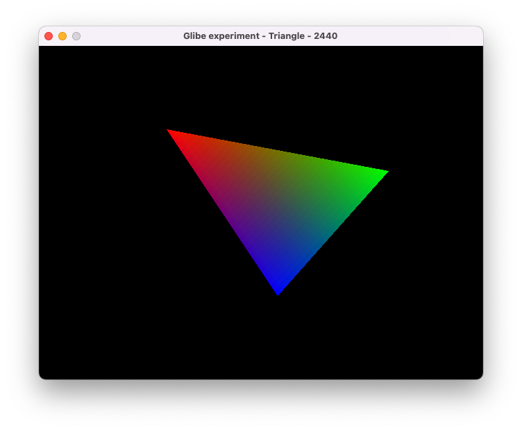
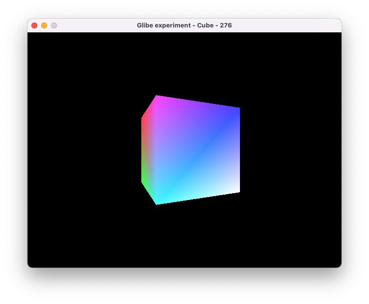

# Self-contained 3dfx Voodoo 1 (SST-1) demos

## What is this?

This repository demonstrates the internal workings of the 3dfx Voodoo 1, the revolutionary 3D accelerator that transformed PC gaming in 1997 and launched the modern 3D gaming industry.

I've integrated the Dosbox-X Voodoo emulator with components of the original 3dfx Glide graphics API to create several small demos that run natively on modern (2025) Mac and Linux systems. By debugging and stepping into the emulator, you could understand how the rasterization process and API works.

## Gallery

triangle.cpp: Basic triangle rendering

cube.cpp: A smooth rotating cube

teapot.cpp: The classic Utah teapot with Gouraud lighting

https://github.com/user-attachments/assets/797c2e0a-169e-4c22-a931-1dc4ed47a739

texcube.cpp: A texture-mapped rotating cube

https://github.com/user-attachments/assets/f94c5fbd-1c50-4d5f-92eb-46100423361e

## Acknowledgements
* Voodoo emulator by [Aaron Giles](https://aarongiles.com/programming/war-mame/).
* [Glide API](https://github.com/Danaozhong/3dfx-Glide-API) open sourced by 3dfx.
